<p align="center">
<div align="center">
    <a href="https://gitee.com/technical-laohu/mpay">
        
    </a>
</div>
<div align="center">
    <a href="https://gitee.com/technical-laohu/mpay" target="_blank">项目主页</a> ｜
    <a href="https://gitee.com/technical-laohu/mpay/releases" target="_blank">源码下载</a> ｜
    <a href="https://f0bmwzqjtq2.feishu.cn/docx/HBVrdrsACo36bzxUCSPcjOBNnyb" target="_blank">使用文档</a> ｜
    <a href="https://f0bmwzqjtq2.feishu.cn/docx/FtphdDA10oBfPyxNEEZc5mgJnqf" target="_blank">常见问题</a> ｜
    <a href="https://f0bmwzqjtq2.feishu.cn/docx/OjlwdPunLoGjL0xodMUcS0xFngX" target="_blank">学习交流</a> ｜
    <a href="https://f0bmwzqjtq2.feishu.cn/docx/PjwOdvBeZoQEHUxF2ZScTjHOnKb" target="_blank">赞赏作者</a>
</div>
<br />
<div align="center">
    😎免签约、🧩多通道、🛜不掉线 - 专注于个人在线收款💴
</div>
</p>

## ✨ 项目介绍

**码支付[mpay]是一款便捷收款工具，专注于个人免签收款，通过普通收款码即可实现收款通知自动回调，支持绝大多数商城系统**

<div align="center">

| <p align="center">gitee</p> | <p align="center">github</p> |
| :----------: | :------------: |
| <a href="https://gitee.com/technical-laohu/mpay"></a>|<a href="https://github.com/techhaha/mpay"></a>|

</div>

## 🚀 快速安装（Docker 一键部署）

适用于 Linux 服务器（Ubuntu / Debian / CentOS 等），自动安装 Docker 并启动服务：

```bash
bash <(curl -L https://raw.githubusercontent.com/abai569/mpay-flvx/main/install.sh)
```

选择 **1. 安装 mpay**，按提示设置端口（默认 8088）和域名（可选）即可完成部署。

安装完成后访问 `http://你的IP:端口/install` 完成 Web 安装向导。

### Docker 镜像

支持 `linux/amd64` 和 `linux/arm64` 双架构，自动从 GitHub Container Registry 拉取：

```bash
docker pull ghcr.io/abai569/mpay-flvx:latest
```

### 手动 docker-compose 部署

```bash
git clone https://github.com/abai569/mpay-flvx.git
cd mpay-flvx
docker compose up -d
```

## 🚀 Mpay v2 项目

<div style="background-color: #f0f8ff; border: 2px solid #4169e1; border-radius: 10px; padding: 20px; margin: 20px 0;">
    <h3 style="color: #4169e1; margin-top: 0;">Mpay v2 项目</h3>
    <p style="font-size: 16px;">基于 webman 框架开发的全新版本，提供更稳定、更高效的收款体验</p>
    <a href="https://gitee.com/technical-laohu/mpay_v2_webman" target="_blank" style="display: inline-block; background-color: #4169e1; color: white; padding: 10px 20px; border-radius: 5px; text-decoration: none; font-weight: bold; margin-top: 10px;">访问 Mpay v2 项目</a>
</div>


## ⚙️ 工具特性

- 开源程序，个人免费使用，不断更新
- 支持第四方收款服务商聚合码收款，免挂机、不掉线
- 支持微信、支付宝个人账户收款，免签约
- 采用易支付接口标准开发，兼容市面上大部分商城系统
- 在H5环境中，能正常长按识别扫码支付
- 支持多平台、多账号、多通道，灵活配置，收款轮询

## ✨ 演示站点

#### 访问 [在线演示](http://demo.stspwsc.com/) 快速体验。

## 📊 项目说明

### 🎈 原因

之前在工作之余，尝试过很多副业项目，基本都是跟互联网相关的。例如使用**Wordpress和zibll主题**建资源站点，用**微擎**和**微课堂V2**卖课程，使用**异次元发卡**和**独角数卡**程序卖代理的**微信营销软件**，其中遇到的让我最头痛的问题就是收款问题。

正规官方渠道，如微信支付宝申请相关支付接口，必须要签约，且有营业执照等相关资质，这对于只想搞想副业的我实在是没必要，也麻烦，后期的事情也多。于是在网上找到了一些解决方案来解决我的在线收款问题。

### 🪄 方案

市场也有很多针对此类需求的平台，也有不少合适的解决方案

#### 虎皮椒/迅虎/蓝兔支付

这些平台都是微信支付宝等官方平台的支付服务商，能签约个人商户，实现在线收款，一些API支付接口可以直接调用，跟官方自己申请的几乎差不多。
优点是跟官方申请的支付接口差不多，N+1到账
缺点就是审核比较严，动不动投诉封商户号，一些羊毛党就爱整你，你是一点办法没有，另外开户基本都要交开户费，50-200不等，且还需要额外收取手续费。

#### 彩虹易支付

彩虹易支付是一套收款程序，有专门的公司或平台用这套程序搭建一个收款平台，使用自己的微信或支付宝等官方账户来进行收款，你自己注商户号，运营方提供代收款服务，然后给你打款结算。
优点是审核不严，处理比较灵活，适合个人，技术支持比较好，注册可使用（有些需要注册费）
缺点就是平台容易卷款跑路，也没有什么有效监管，钱收不回来就亏大了（这也是最大的问题）

#### 源支付/V免签

源支付也是一套收款程序，有个人版和商户版，市面上能搜到的大部分都是商户版，可以入驻，使用自己的个人微信支付宝二维码收款。

V免签是一款开源免费适用于个人收款使用的收款程序，原理同源支付类似。
程序的设计思路主要是通过在手机或电脑上安装消息监听软件，用来监听获取微信和支付宝的收款到账通知来实现的支付成功回调的。**方法很实用，本程序也添加了该功能插件，免费**。


## ✨ 开发思路

### 🎯 服务商聚合码

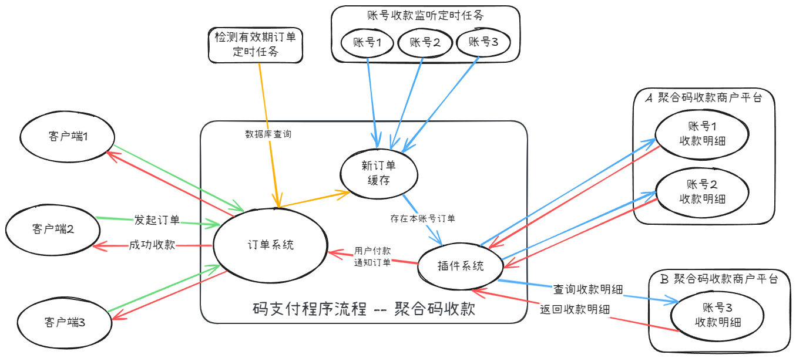

码支付说到底就是通过二维码来进行收款，日常使用的除了微信支付宝生成的二维码外，还有一类二维码是由收款服务商提供的，它能通过一张收款二维码，同时支持**微信**、**支付宝**、**云闪付**等多渠道付款，一般称为**聚合收款码**。


这类收款码扫码之后需要用户自己输入指定金额来进行付款，然后查看收款通知，确认是否到账，最后确认订单支付成功。

就像你去店子里买一瓶水，你扫二维码进去付款界面，就生成了一个订单，你付款成功之后，商店老板会去查看一下商户后台流水，确认订单是否支付成功，这是一个人工审核的过程。

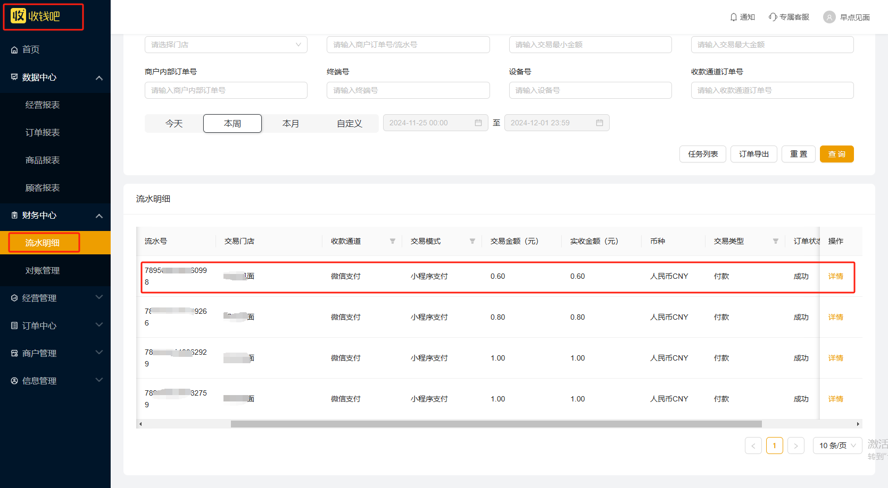

那么码支付的作用，就是让人工审核变成自动审核的，当用户通过网站购买商品的时候，码支付会生成一个订单并展示收银台界面，用户再扫码进入聚合码付款页面。

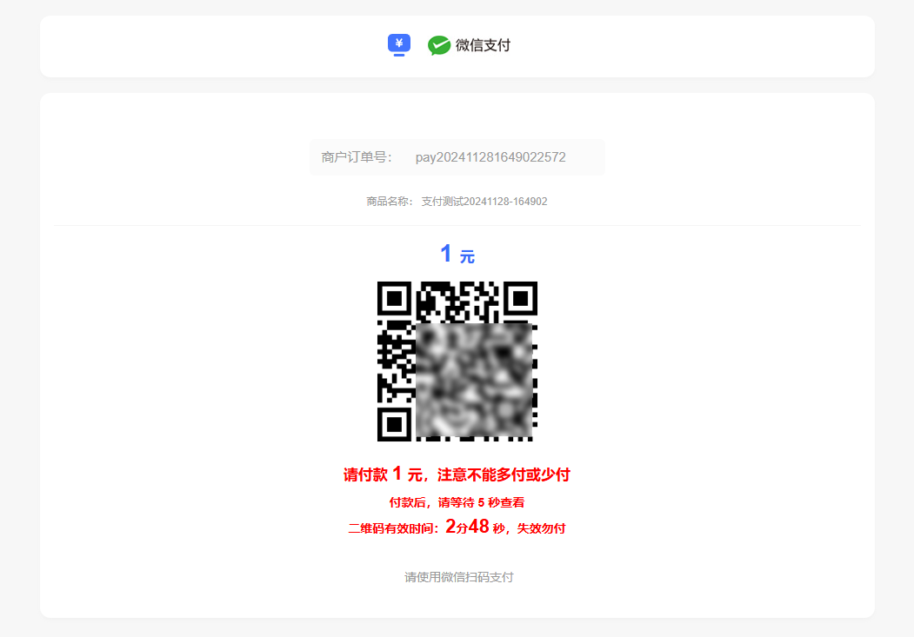

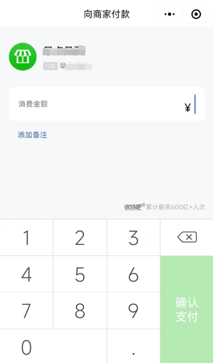

同一时间，**码支付后台会自动通过账号密码登陆聚合码服务平台的管理后台**，并通过API接口，循环查询最近的收款明细，通过比对金额和时间，确认是否付款到账，最后确认成功收款。

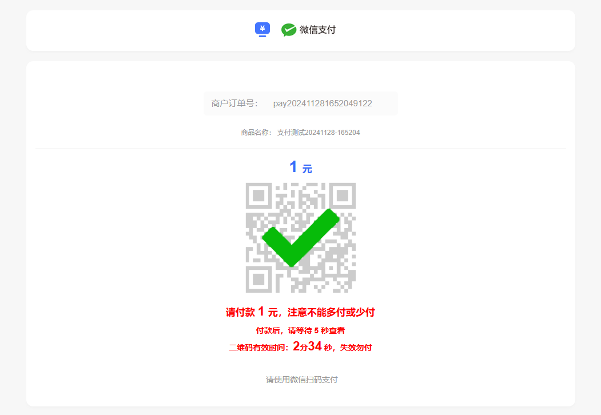

当用户付款成功，并且后台检测到收款成功消息后，收钱台就会提示收款成功，并最终确认收款。

> 只有存在新订单时，且该订单与当前收款账号一致时，码支付后台才会主动登陆该账号，查询收款流水，减少频繁查询导致的可能风险

> 另外，在账号设置里也有两个模式可选，`单次监听`和`连续监听`，根据业务场景可以自行选择，具体使用，下面有介绍

### 🪁 微信、支付宝收款码

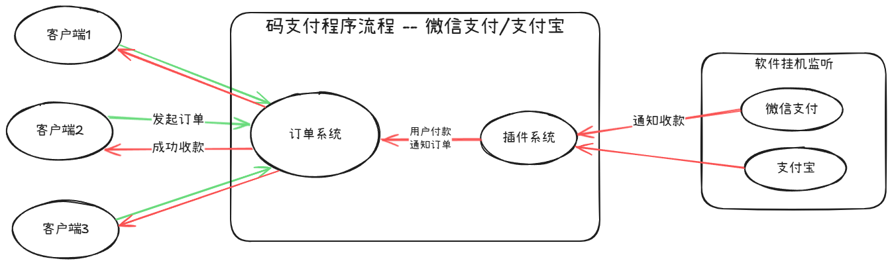

普通的个人收款码，大多使用微信/支付宝来进行收款，依赖于微信/支付宝平台的推送服务和系统通知机制，就可以获取到收款金额的通知信息，从而可以实现支付回调，自动确认收款。
目前主流的方式也是这种，来实现自动收款，简单方便，不过有一些小问题：
- 微信/支付宝的收款通知推送，需要软件挂机进行监听，否则无法确认收款
- 监听软件因手机或PC系统的不同，可能会出现各种监听不稳定的问题
- 微信个人码因升级，在微信H5环境里无法长按识别付款

## 📦 技术架构

| 层级 | 技术 |
|---|---|
| 后端 | ThinkPHP 8（PHP 8.0+，推荐 8.2） |
| 前端 | Layui 2.9 + PearAdmin 后台 |
| 数据库 | SQLite（内置，零配置） |
| Web 服务器 | Nginx（Docker 内置） |
| 运行环境 | Docker（支持 amd64 / arm64） |

## 🧰 内置插件

码支付收款工具开源免费使用，插件中心的插件列表有**免费版**和**付费版**版，按需使用购买

1. **微信**插件`wxpay`默认安装，支持`赞赏码`、`个人码`、`经营码`、`商家码`，需挂机监听
2. **支付宝**插件`alipay`默认安装，支持`收钱码`、`经营码`，需挂机监听
3. **收钱吧**聚合码插件`sqbpay`默认安装，无需挂机，设置定时任务即可监听回调

---

## 📝 安装说明

### 方式一：Docker 一键部署（推荐）

适用于任何 Linux 发行版，无需手动安装 PHP / Nginx / MySQL：

```bash
bash <(curl -L https://raw.githubusercontent.com/abai569/mpay-flvx/main/install.sh)
```

脚本包含完整的交互菜单：

```
===============================================
          mpay 安装管理脚本
===============================================
1. 安装 mpay
2. 更新 mpay
3. 卸载 mpay
4. 备份数据
5. 恢复数据
6. 域名反代 (Caddy)
7. 退出
===============================================
```

**安装流程：**
1. 运行脚本，选择 **1. 安装 mpay**
2. 输入访问端口（默认 **8088**）
3. 可选配置域名反代（自动申请 SSL 证书）
4. 等待 Docker 镜像构建完成（首次约 5-10 分钟）
5. 访问 `http://你的IP:端口/install` 完成 Web 安装

> SQLite 数据库文件自动通过 Docker 卷持久化，重启不丢失。

### 方式二：宝塔面板安装

以下演示基于**云服务器**环境+**宝塔面板**安装，云服务器购买可以去阿里云、腾讯云等平台，宝塔面板安装教程参考[宝塔面板安装教程](https://www.bt.cn/new/download.html)

#### 安装配置

以**宝塔面板**示例，其他服务器管理面板可以参考

通过宝塔面板登陆管理后台，新建PHP站点和数据库，并确认创建

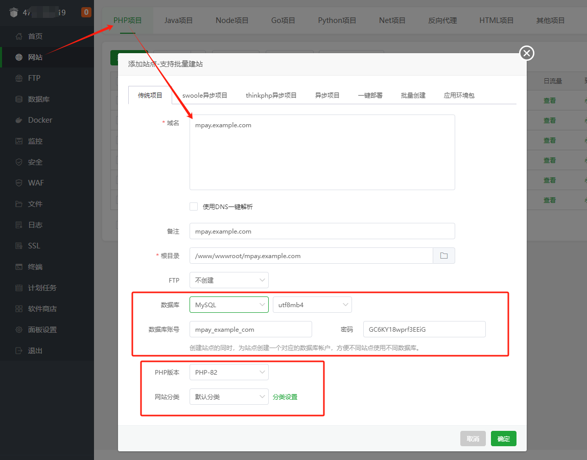

在网站列表页面，点击创建的网站的根目录，进入文件管理

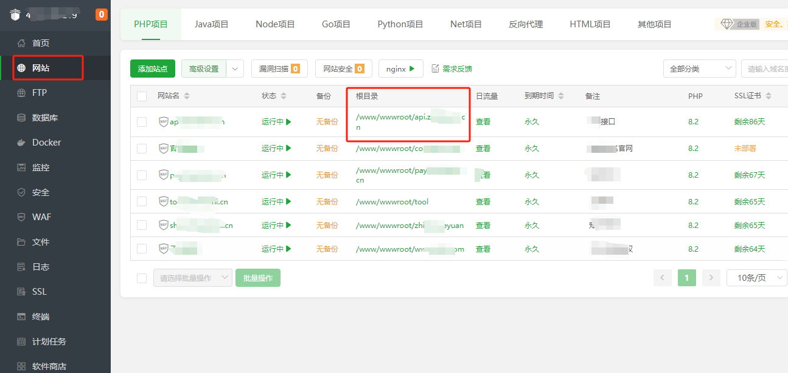

文件夹里面有一些默认文件，不用管他

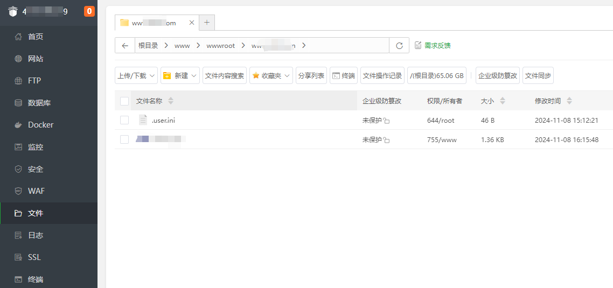

从 [Releases](https://github.com/abai569/mpay-flvx/releases) 下载源码压缩包并上传到网站目录解压

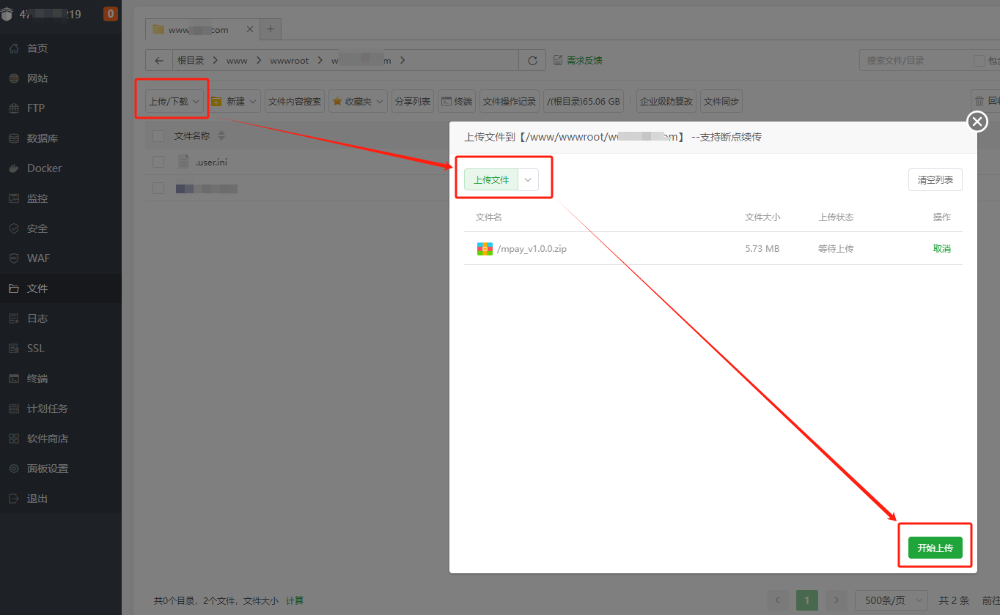

**将所有文件复制到网站根目录下**

#### 运行目录 & 伪静态 配置

选择**网站目录**，运行目录选择`public`，保存

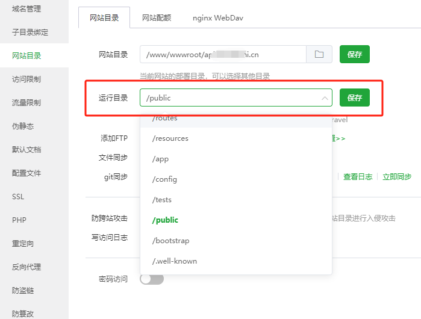

选择**伪静态**，模版选择`thinkphp`，即可自动填写，保存

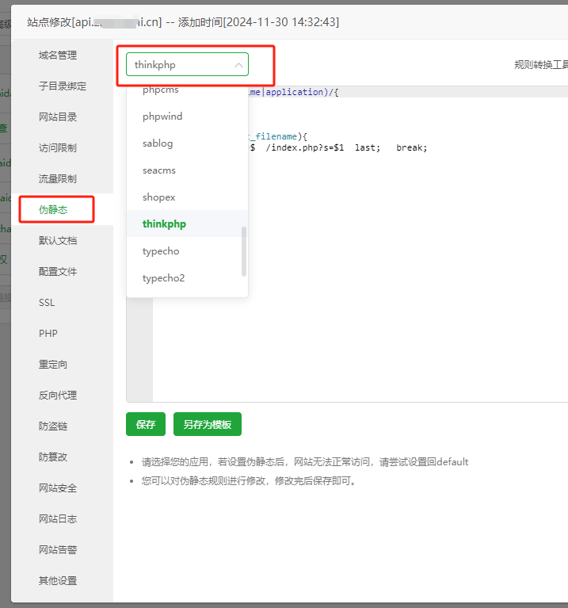

#### 安装步骤

浏览器访问 `http://你的域名/install`，进入程序安装界面，按提示填写数据库等信息完成安装。

> 宝塔方式需要自行安装 PHP 8.0+ 和 MySQL 5.7+，推荐使用 Docker 方式更简单。

---


## ❤️ 聚合码收款

如果本身就有聚合码收钱码最好，没有就需要提前去各收银服务商申请，申请也不复杂

### 申请收款码

以下列出一些常见收款服务平台，可以按需申请，个人直接申请小微商户即可

| 平台   | 官网                                  |
|--------|--------------------------------------|
| 收钱吧  | https://www.shouqianba.com/         |
| 小Y经营 | https://xym.ysepay.com/             |
| 码钱    | https://m.hkrt.cn/                  |
| 拉卡拉  | https://customer.lakala.com/        |
| 盛付通  | https://b.shengpay.com/             |

> 申请可以去官方平台注册账号等客服电话，或者在社群里询问(有很多人有代办资质)，实在找不到的，可以去淘宝上的官方店买个二维码卡牌贴纸，然后询问客服如何开通账号就行，会有专员联系你开通。

### 安装插件

程序默认安装有**微信支付**`wxpay`、**支付宝**`alipay`、**收钱吧**`sqbpay`三个插件，基本能满足大家的日常收款需求。

如果需要其他收银平台插件，可以在插件中心自行安装，插件中心没有的，也可以联系作者定制开发。

### 添加账号

除**微信支付**`wxpay`、**支付宝**`alipay`之外，所有的收款平台均为聚合码收款平台

以**收钱吧**`sqbpay`为例，添加账号时，需要填写**收钱吧**商户管理中心的**登陆账号**和**登陆密码**，需要使用时，插件会自动在后台登陆账号并查询相关订单流水信息。

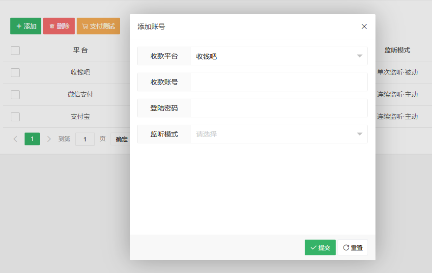


**监听模式**说明，分为`单次监听`和`连续监听`，

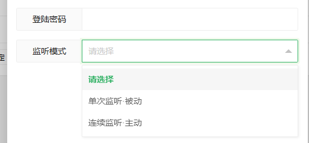

`单次监听`是在收银台页面，用户扫码支付成功后，需要手动点击**确认支付**，后台才会登陆查询该账号的收款流水情况，**点击一次，查询一次，不点击，则不会查询**，降低密集查询可能导致的账户风控

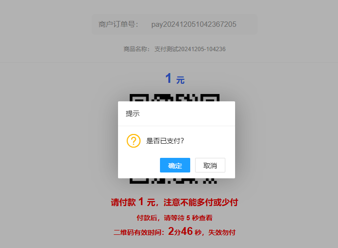

`连续监听`是在创建订单之后，**在订单有效期内且订单未完成状态时**，插件会一直连续不断的查询账户流水详情，直到过期或者成功收款，用户不需要主动点击确认

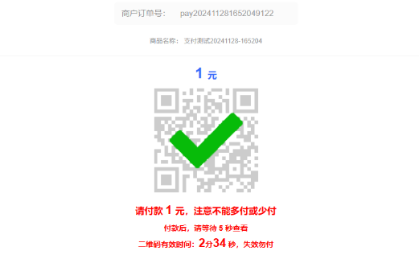

> 使用哪种监听模式，视应用场景自行选择，一般选择**连续监听**即可，如果日常订单比较密集，可以选择**单次监听**，或多添加几个账号，减少密集查询风控

### 添加收款码

点击可以查看当前账号的所有收款码

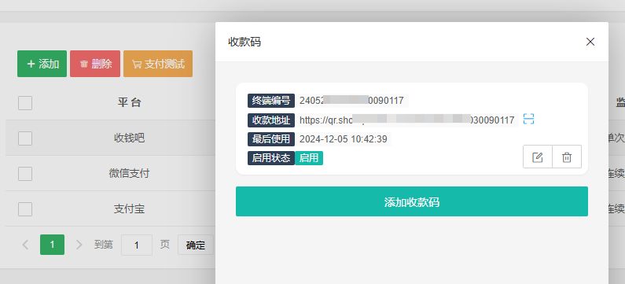

点击**添加收款码**后，可以正常填写二维码信息

**终端编号**需要填写当前收款码在收银服务商系统内的编码，有的可以直接在收款二维码解析的**链接里找到**，有的需要**登陆商户管理中心**，去订单详情里查询才能知道

🚀️ 具体各个平台的终端编号如何获取，可以去**程序后端控制台主页**的`项目文档`查看🚀️

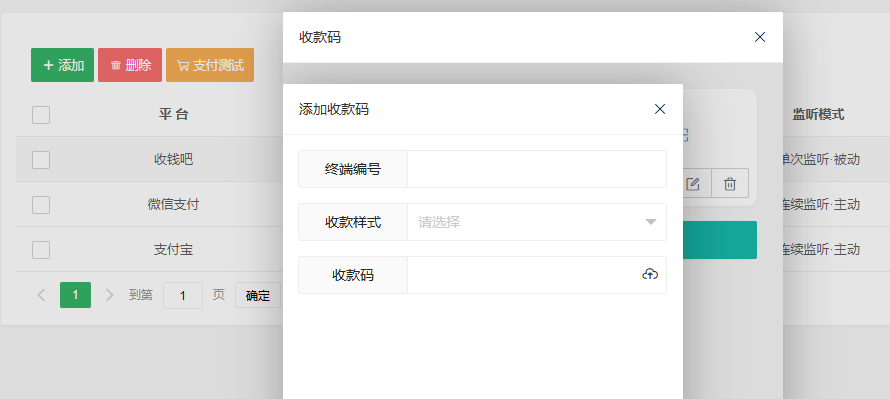

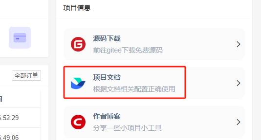

收款样式有两个选项`付款链接`和`图片地址`，根据实际情况选择

**付款链接：** 将二维码的内容解析成字符串保存，使用时再生成二维码

**图片地址：** 上传二维码图片到服务器，或引用http远程图片地址

> 一般的**聚合收款码都解析成文字保存**即可，前端展示时会重新生成二维码，无法解析的就上传图片

### 🚀️ 设置监听

#### 宝塔任务计划

等会儿需要在这里设置任务监听

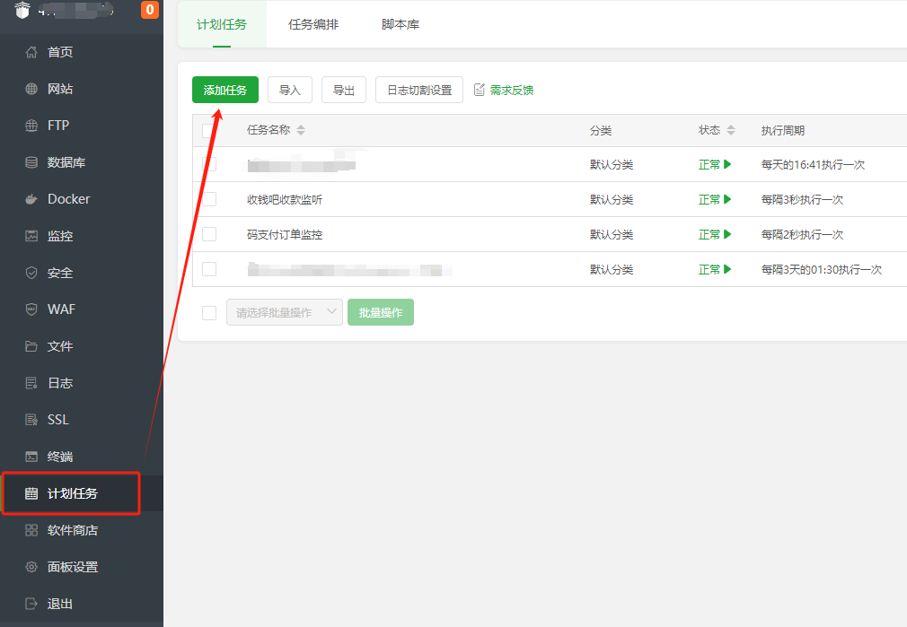

#### 新订单监听

一个站点只需要设置一个定时任务，每次访问都会查询一次数据库，并生成新订单数据缓存

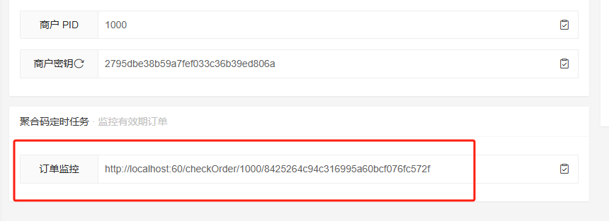

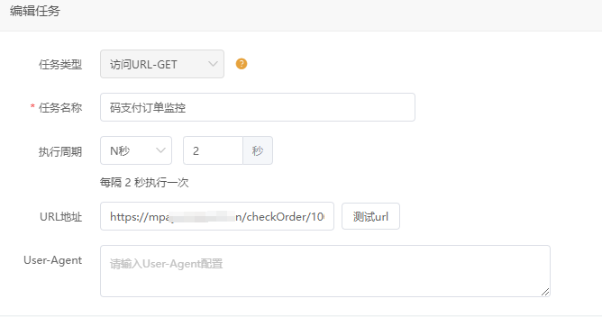

#### 账号监听

**每个账号都需要单独设置一个定时任务**，每次访问都会检索新订单缓存数据，如果存在该账户的新订单，插件就会去查询服务商后台的订单流水，并通知相关收款处理程序

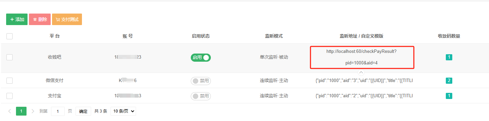

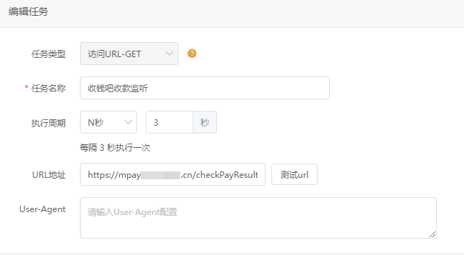

### 支付测试

只开启一个账号，然后点击`支付测试`，正常支付后，观察是否成功回调，如果不能回调请重新检查配置，或再次详细查看**程序后端控制台主页**的`项目文档`

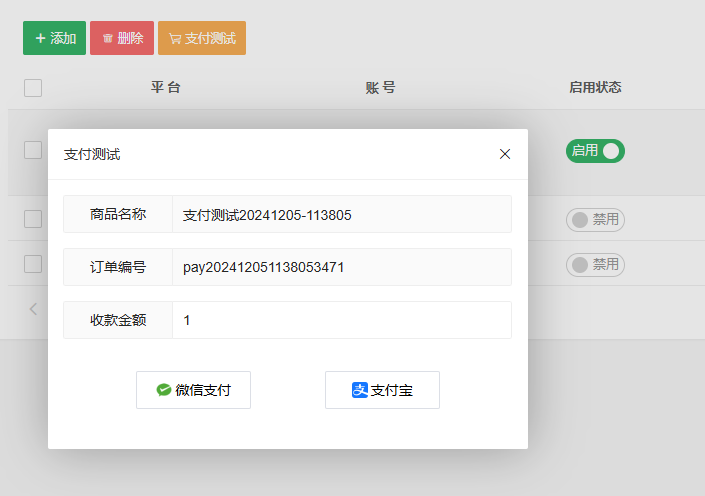

---

## ❤️ 微信/支付宝收款

微信/支付宝生成的收款码，需要挂机监听收款消息，基本情况上面有介绍，因为使用广泛，所以也单独添加进来，可以实现正常收款回调

### 添加账号

收款平台选择`微信支付`或`支付宝`，收款账号就填写`微信支付`或`支付宝`的账号，与**聚合码支付**不同，此处填写的账号主要用来做区分，不会登陆后台

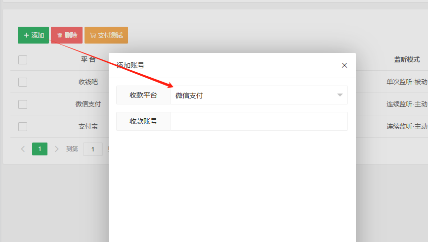

### 添加收钱码

点击可以查看当前账号的所有收款码

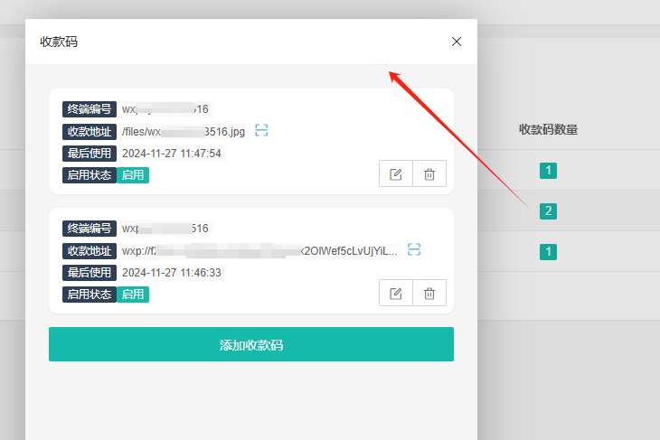

点击**添加收款码**后，可以正常填写二维码信息

`微信支付`和`支付宝`的终端编号是自动生成的，不可手动填写，分别对应当前账号的不同收款通道，支持`个人码`和`赞赏码`

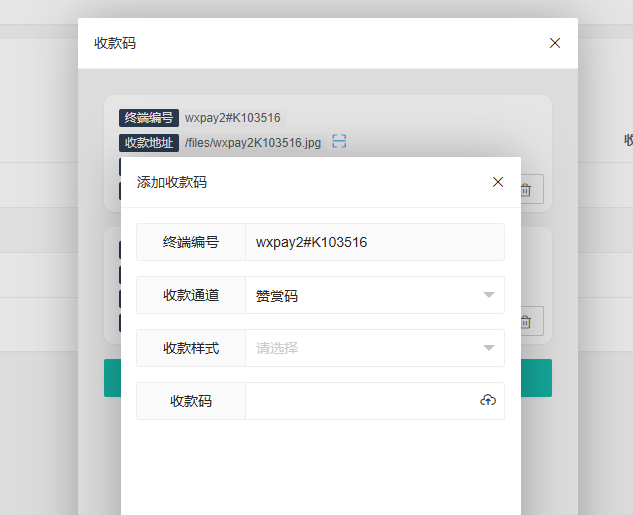

收款样式有两个选项`付款链接`和`图片地址`，根据实际情况选择

**付款链接：** 将二维码的内容解析成字符串保存，使用时再生成二维码

**图片地址：** 上传二维码图片到服务器，或引用http远程图片地址

> `赞赏码`等收款方式，采用的不是标准二维码编码格式，不能解析成文字保存，只能展示图片，建议一般**二维码都解析成文字保存**，前端展示时会根据内容自动再生成二维码，无法解析的就上传图片

---

### 挂机监听收款通知

收款通知信息需要挂机监听，有`手机监听`和`PC监听`两种，手机可以同时监听微信和支付宝，PC只能监听微信，具体支持的通知和功能在设置账号页面有详细介绍。

#### 🚀️ 手机软件下软(安卓)

码支付使用的是开源工具**短信转发器**`SmsForwarder`来监听收款通知，`SmsForwarder`功能非常强大，喜欢*搞机* 的朋友可以多钻研，这是使用文档[短信转发器](https://gitee.com/pp/SmsForwarder/wikis/pages)

* **开源项目地址：[SmsForwarder](https://gitee.com/pp/SmsForwarder)**
* **发布地址，尽量下载最新版，兼职更多机型：[SmsForwarder](https://gitee.com/pp/SmsForwarder/releases)**
* **网盘地址，访问密码：`pppscn`：[SmsForwarder](https://wws.lanzoui.com/b025yl86h)**

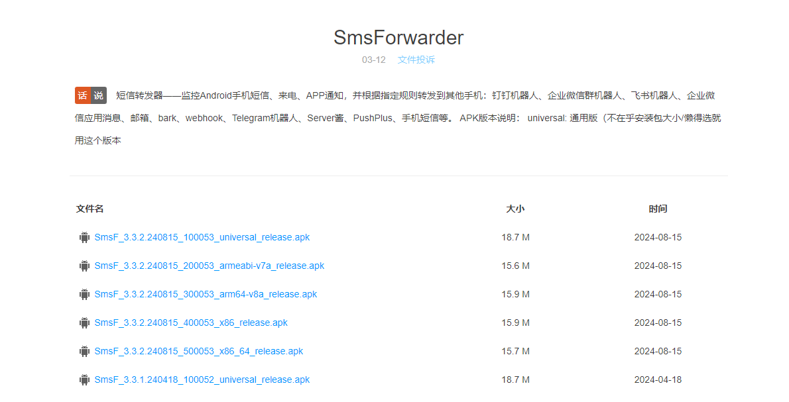

---

##### 功能配置

找一台不常用的安卓系统手机，下载安装好`SmsForwarder`之后，点开进行配置，同时打开码支付后台**用户中心**页面，查看相关配置参数

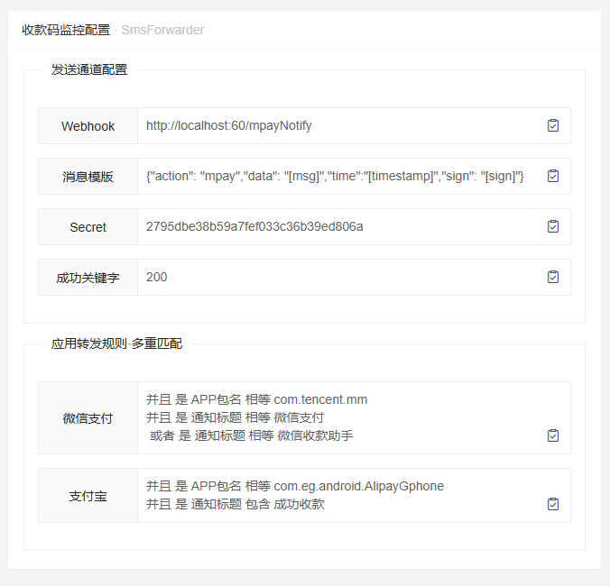

##### **通用设置**

1. 开启转发应用通知，只针对应用软件才会转发
2. 保活措施全部开启（实际情况看手机环境）
3. 通知栏文案可以自定义，方便自己运维，可参考图片
4. 其他默认即可，也可以参考实际情况自行设置

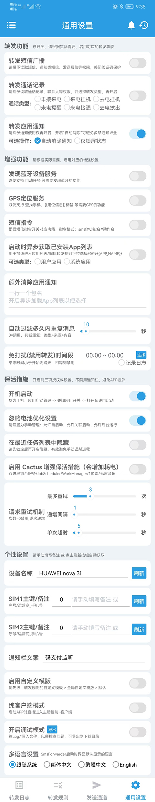

##### **发送通道**

添加发送通道，选择`Webhook`类型

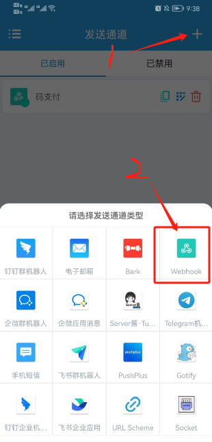

**编辑规则**

1. 通道名称自行命名，方便区别就行
2. 请求方式选择`POST`方式
3. Webhook Server 地址**用户中心**查看
4. **消息模版**在**用户中心**查看
5. **Secert**密钥在**用户中心**查看
6. 应签关键字`200`

填写完成点击**保存**即可

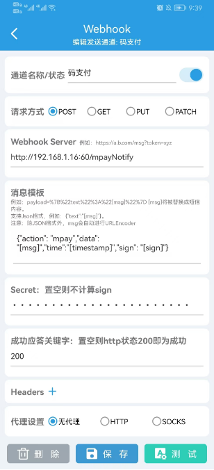

##### **转发规则**

添加应用转发规则，**微信**和**支付宝**需要分别设置，请注意选择**应用**规则

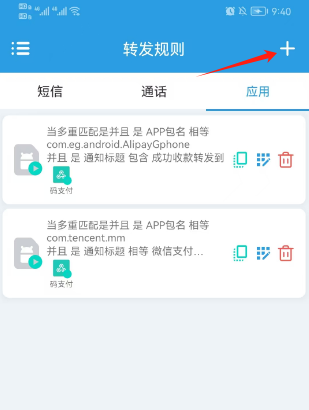

**具体设置**

1. 选择发送通道
2. **匹配字段**选择**多重匹配**，**匹配的值**去**用户中心**复制，然后粘贴过来
3. 开启**启用自定义模版**，内容填写去码支付后台**账号列表**里复制，粘贴过来

**注意：** 微信支付规则里，第三行的`[空格]`需要替换成真实的` `空格

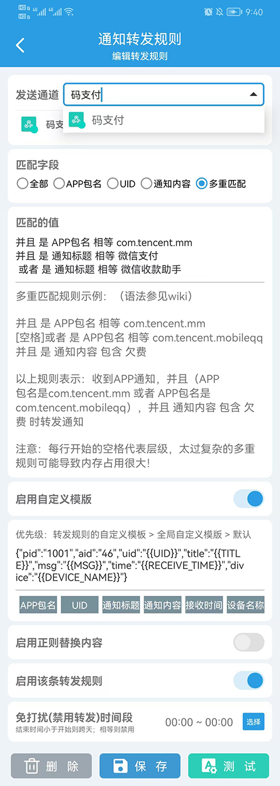

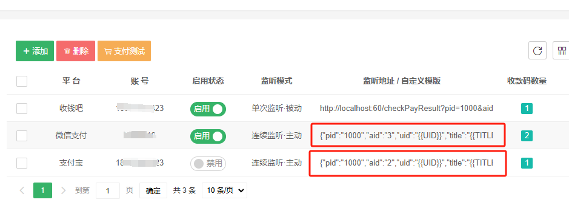

---

##### **转发日志**

这里可以查看所有的转发记录，点击也可以查看消息详情

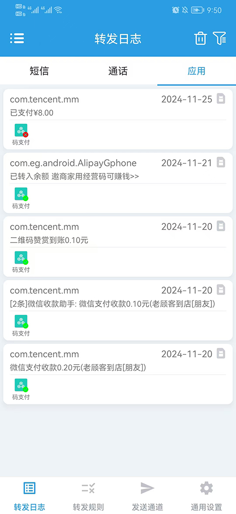

##### **注意事项**

用户中心后台里的配置APP包名不一定与手机应用里的包名一致，需要查看一下，如果有区别，请修改成实际本机显示的APP包名，下面有图片演示操作

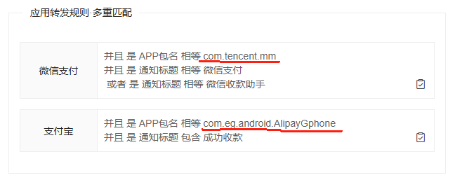

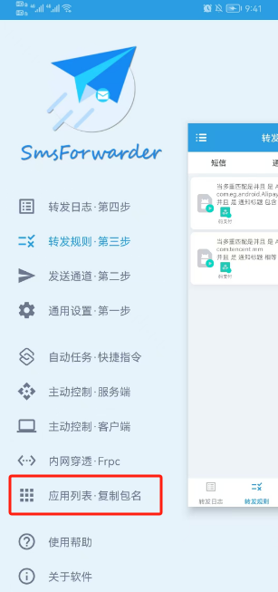

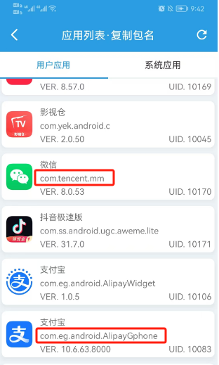

#### 🚀️ PC软件下载

码支付微信PC监听，是老胡使用python写的小工具，可以监听电脑桌面打开的窗口和内容信息，非侵入微信应用内部，版本升级不影响监听。需要将被监听的微信聊天界面单独拖出来成独立窗口。

[PC监听软件下载wxmonitor_v1.2.zip](assets/wxmonitor_v1.4.zip)

##### 配置信息

1. 打开用户中心，添加接口密钥等信息

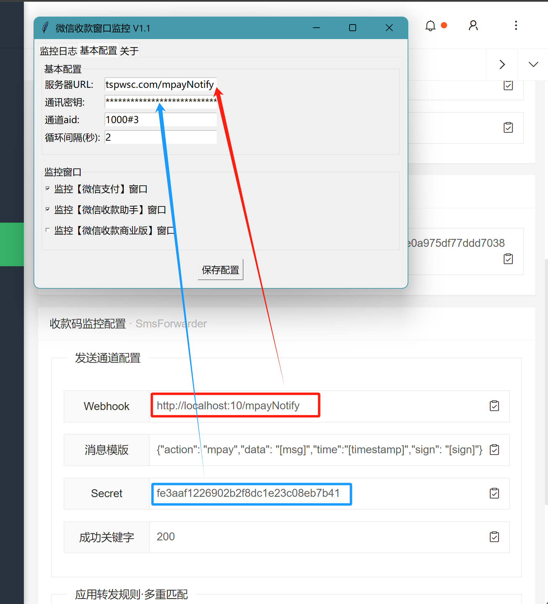

2. 打开账号管理列表，填写通道信息，格式`pid#aid`

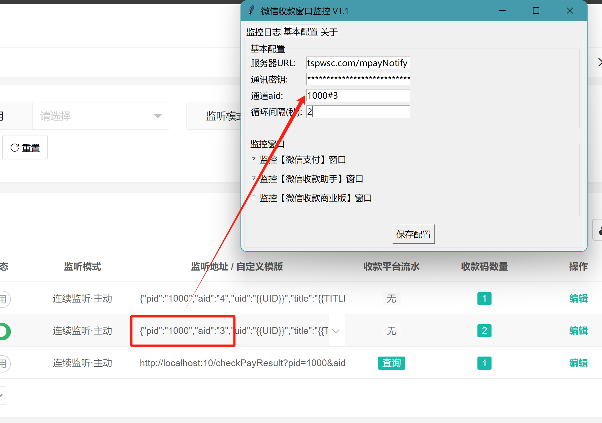

3. 循环间隔是软件检索窗口通知信息的循环时间，一般设置1-3秒均可，看电脑性能
4. 监控窗口根据实际情况勾选，哪个窗口需要检索收款通知，就开启哪个，不使用的就不需要开启

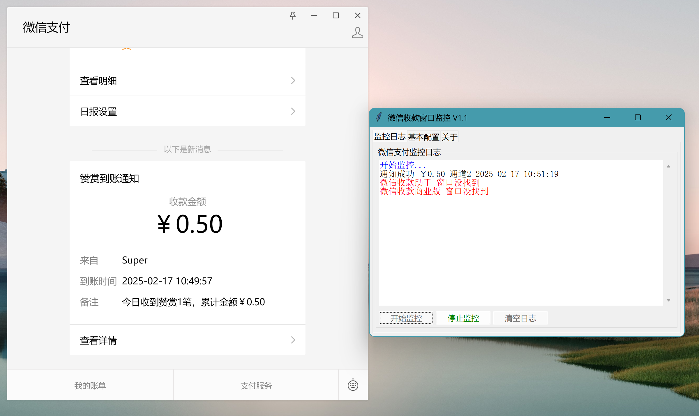

5. PC监听同时支持个人码、经营码、赞赏码、商户码，**手机监听因无法区分个人码和经营码，添加时只能二选一，且只能在`个人码`通道添加**。

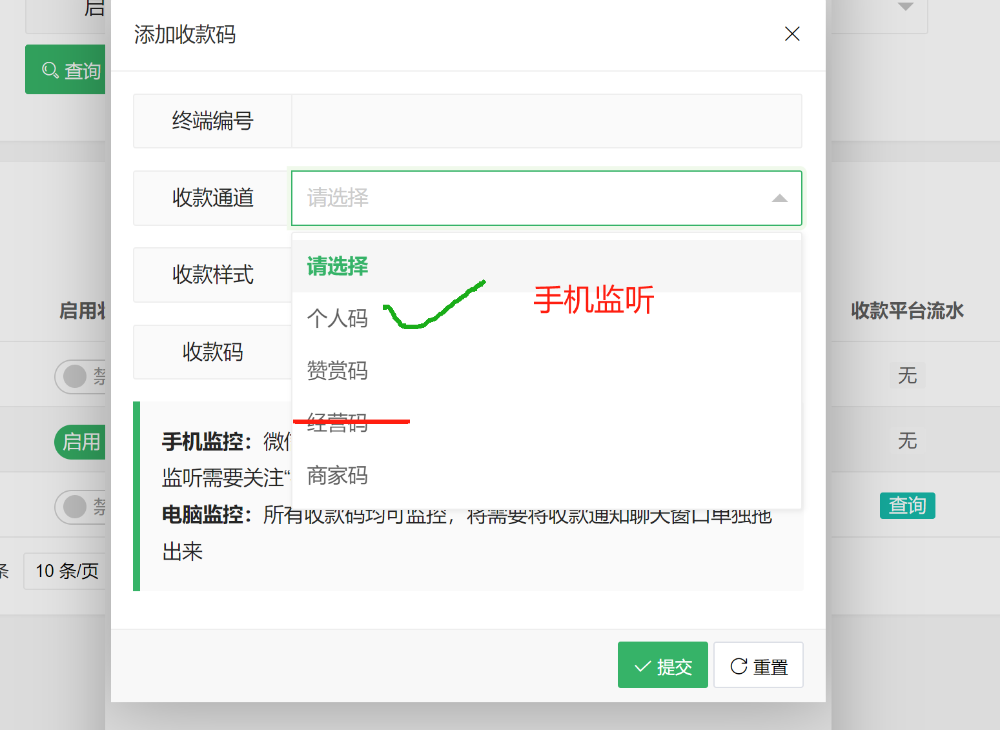

7. PC监听和手机监听，只需要开启一个即可，不要同时开启，会出现重复通知，导致订单异常。

---

## 🔎 补充说明

- **码支付**是一个**个人免费使用**的收款工具，**码支付**的**源码**是开源的，你可以根据自己的实际情况进行修改，也可以自行开发，有任何问题，可以社区交流
- 该软件仅适用于个人线上免签收款，避免人工审核确认收款的繁琐步骤。实际使用中请勿用于诈骗、黑灰产业，如有此类行为，一经发现直接举报
- 插件中心目前还在开发中，不支持在线安装插件，如果有购买插件或定制其他收银平台插件的需求，可以联系作者，Wechat:**K103516**

## 📬 学习交流

社群答疑、插件定制、技术交流，添加微信拉群，请备注：**码支付**

微信：**K103516**
备用：**HU1094551889**


## 💰 赞赏作者


|姓名   | 金额  |
|---|---|
| 知汇学社  | 100  |
| exrock  | 100  |
| A筱磊  | 6.66  |
| 云峰  | 8.88  |
| 零零  | 200  |
| 子染  | 88  |
| John  | 100  |
| 辰起  | 8.88  |

## 🔗 友情链接

1. [腾飞博客，专业WP子比主题美化定制](https://calfbxtoi72.feishu.cn/docx/DA3ddthzOolQ16xDgeOcHA36nrg)

## 📷 项目截图

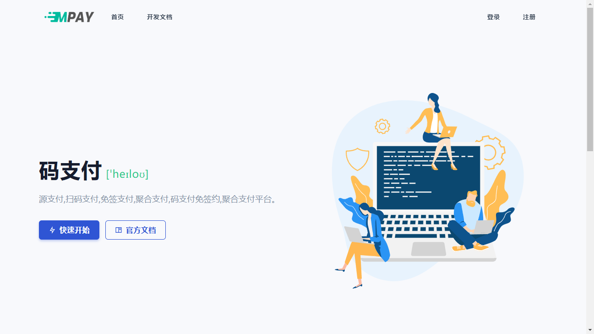

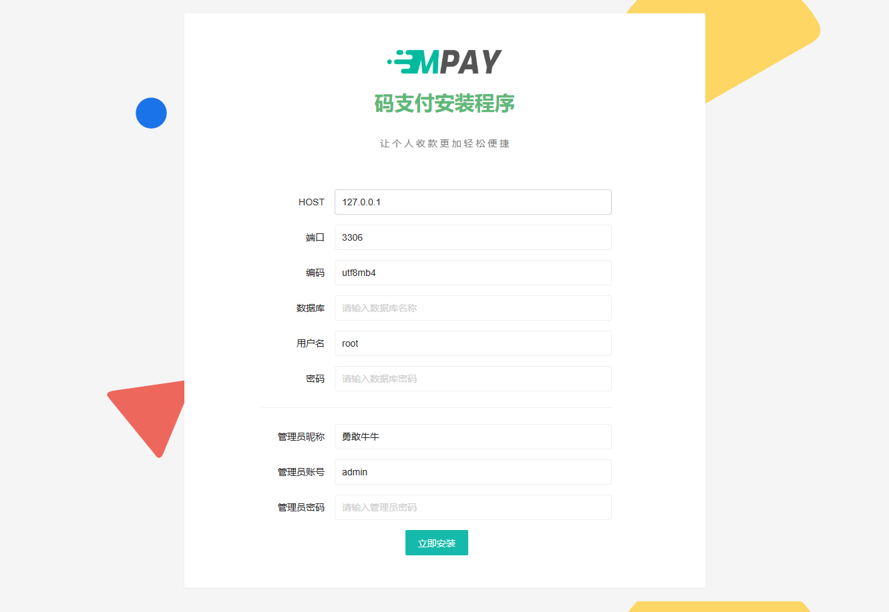

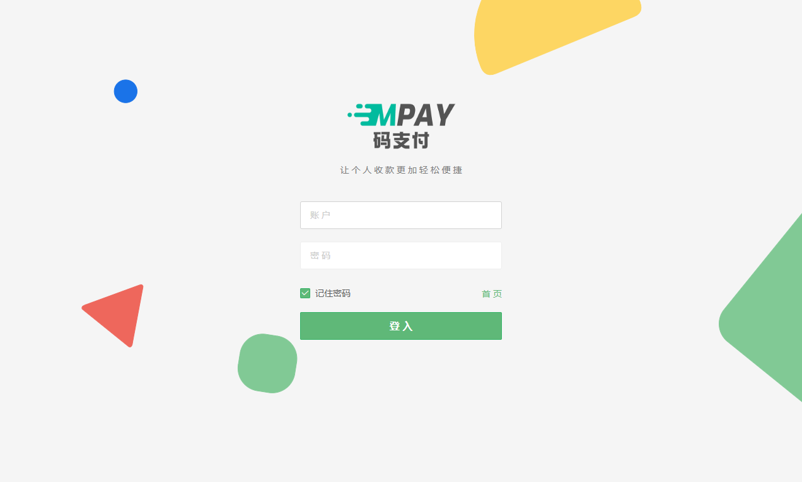


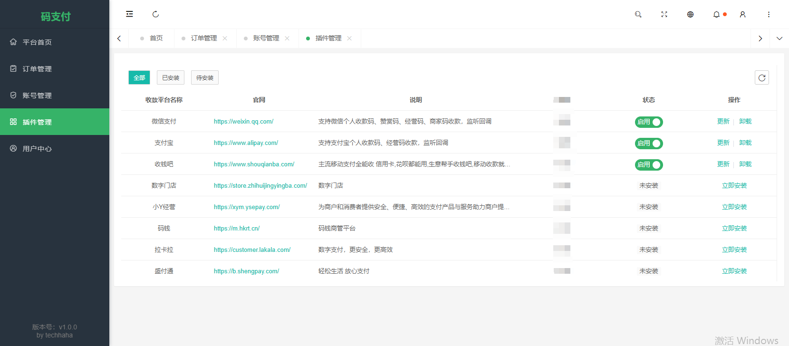

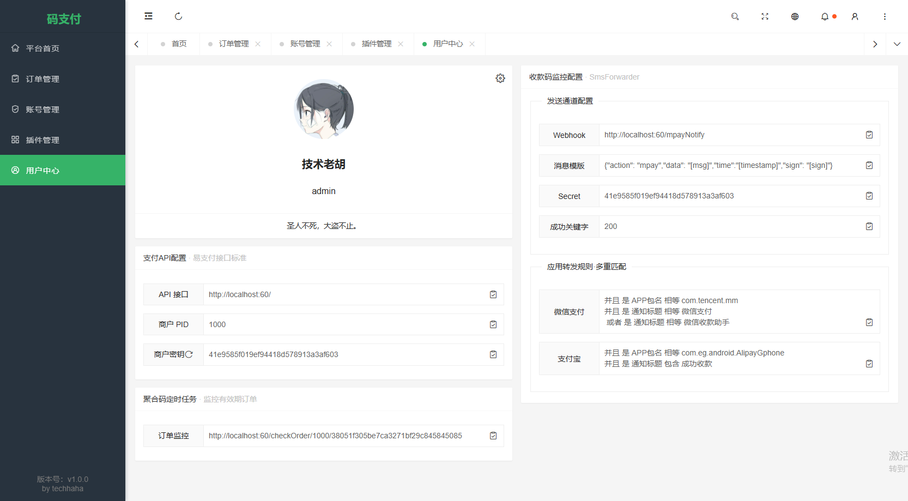

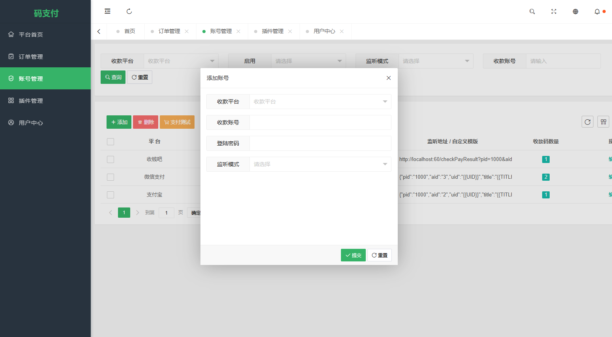


