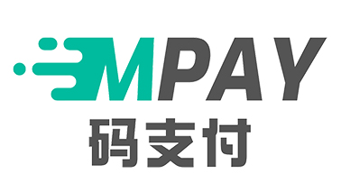
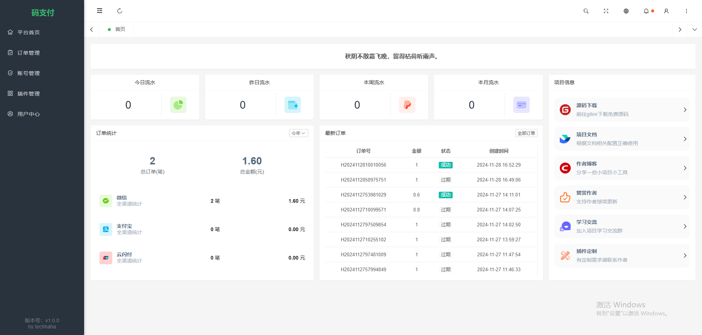
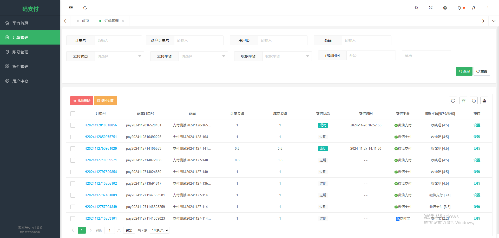
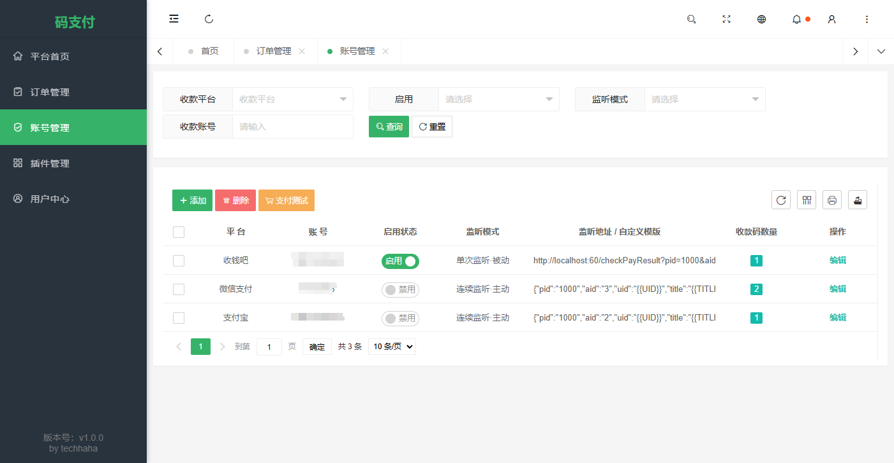

<p align="center">
<div align="center">
    <a href="https://github.com/abai569/mpay-flvx">
        
    </a>
</div>
<div align="center">
    <a href="https://github.com/abai569/mpay-flvx/releases" target="_blank">源码下载</a> ｜
    <a href="https://f0bmwzqjtq2.feishu.cn/docx/HBVrdrsACo36bzxUCSPcjOBNnyb" target="_blank">使用文档</a> ｜
    <a href="https://f0bmwzqjtq2.feishu.cn/docx/FtphdDA10oBfPyxNEEZc5mgJnqf" target="_blank">常见问题</a>
</div>
<br />
<div align="center">
    😎免签约、🧩多通道、🛜不掉线 - 专注于个人在线收款💴
</div>
</p>

## 简介

**mpay-flvx** 是基于 [码支付 mpay](https://gitee.com/technical-laohu/mpay) 的魔改分支，一款个人免签支付网关。通过普通收款码实现收款通知自动回调，支持绝大多数商城系统（独角数卡、彩虹易支付等）。

支持 **聚合码**（收钱吧/拉卡拉等，免挂机）和 **个人码**（微信/支付宝，需挂机）两种收款模式。

## 特性

- 开源免费，基于 ThinkPHP 8 持续更新
- 支持第四方聚合码收款，免挂机不掉线
- 支持微信/支付宝个人码收款，免签约
- 兼容易支付接口标准，对接市面大部分商城
- 多平台、多账号、多通道灵活配置，轮询收款

## 技术栈

| 层级 | 技术 |
|------|------|
| 后端 | PHP 8.0+ / ThinkPHP 8 |
| 前端 | Layui 2.9 + PearAdmin |
| 数据库 | MySQL 5.7+ |
| 运行 | Nginx / Apache |

## 快速安装（宝塔面板）

### 1. 下载源码

从 [Releases](https://github.com/abai569/mpay-flvx/releases) 下载最新版 `mpay-flvx-v1.2.4.tar.gz`。

### 2. 新建站点

宝塔面板 → 网站 → 添加站点：
- PHP 版本选择 **8.0 以上**（推荐 8.2）
- 同时创建 MySQL 数据库

### 3. 上传解压

进入网站根目录，上传压缩包并解压，将所有文件复制到根目录。

### 4. 配置运行目录

网站设置 → 网站目录 → 运行目录选择 `/public` → 保存。

### 5. 配置伪静态

网站设置 → 伪静态 → 选择 **ThinkPHP** 规则 → 保存。

若手动配置 Nginx，规则如下：

```nginx
location ~* (runtime|application)/{
    return 403;
}
location / {
    if (!-e $request_filename){
        rewrite  ^(.*)$  /index.php?s=$1  last;   break;
    }
}
```

### 6. 运行安装向导

浏览器访问 `http://你的域名/install`，按提示填写数据库信息完成安装。

### 7. 设置定时任务（重要）

宝塔 → 计划任务 → 添加以下任务：

**新订单监听**（任务周期 1-5 分钟）：
```
curl http://你的域名/checkOrder/{pid}/{sign}
```

**账号监听**（每个收款账号单独设置，周期 1-5 分钟）：
```
curl http://你的域名/checkPayResult
```

具体参数在后台用户中心查看。

## 环境要求

- PHP >= 8.0（推荐 8.2）
- MySQL 5.7+
- Nginx / Apache
- Composer（可选，用于二次开发）

## 项目截图





## 更新日志

### v1.2.4

- 基于 mpay 1.2.4bb 版本
- 优化安装流程
- 支持宝塔一键部署

## 许可证

[MIT](LICENSE)

Copyright (c) 2024-present
